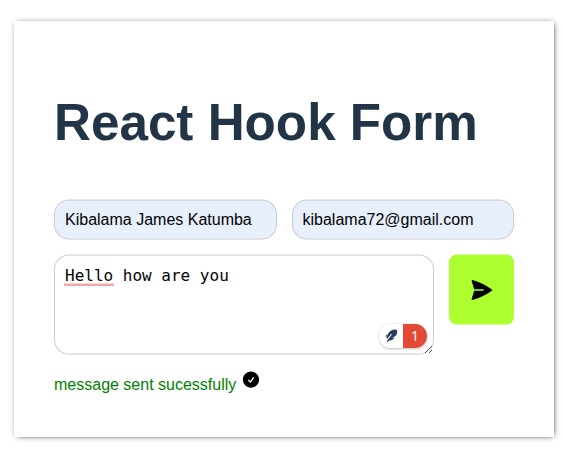
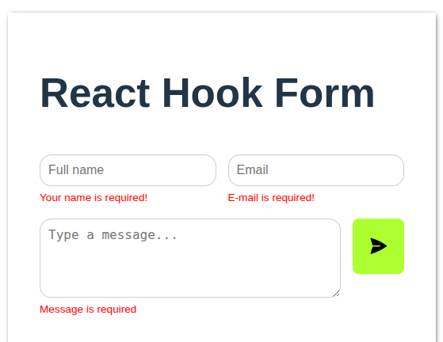

# React Hook Form Contact Form

A responsive contact form built with **React** and **React Hook Form**, with real-time validation, error handling, and a success indicator. 


---

## Features

- **Real-time validation** for name, email, and message fields.
- **Responsive design** for desktop and mobile.
- **Error handling** with feedback messages for invalid inputs.


---

## Installation

1. Clone the repository:

```bash
git clone https://github.com/kibalamaa/React-Form.git
cd React-Form
npm install
npm run dev
